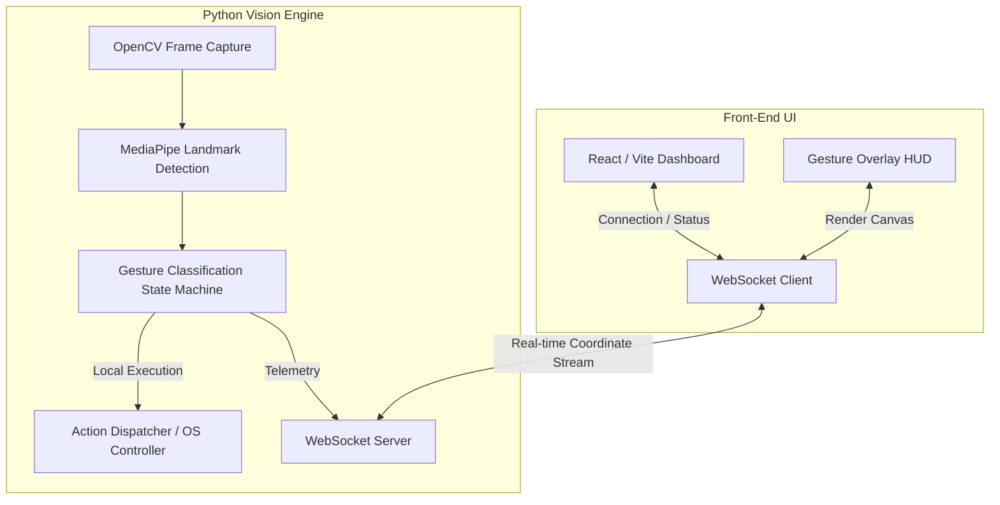

# AuraControl

> Real-time contactless computer interaction using hand gestures and contextual classification.

[Repository](https://github.com/Tusharkapoor-oop/Advance_hand_gesture)

---

## ◈ Overview

AuraControl is a universal contactless interface that translates hand gestures into computer actions via a real-time computer vision pipeline. The system tracks 21 hand landmarks, classifies specific gesture patterns, and maps them to context-dependent actions (such as media control, virtual canvas drawing, or presentation traversal).

Instead of relying on heavy machine learning models that introduce latency, AuraControl utilizes lightweight mathematical geometry and state machines, running comfortably at 30+ FPS on consumer hardware.

---

## ◈ Architecture

AuraControl decouples the heavy computer vision processing from the front-end user interface using a WebSocket architecture.



---

## ◈ Key Engineering Decisions

### 1. WebSockets vs. HTTP Polling
**Problem:** Polling a REST API for hand coordinates creates unacceptable UI stutter and latency in an interface designed for smooth physics interactions.
**Solution:** A persistent WebSocket connection was established between the Python core and the React front-end, allowing bi-directional coordinate streaming at 60Hz.

### 2. Algorithmic Geometry vs. Deep Learning
**Problem:** Training a neural network to recognize gestures requires high compute and introduces prediction latency.
**Solution:** The system calculates euclidean distances and angles between specific MediaPipe nodes (e.g., thumb tip to index tip) to build deterministic state machines (e.g., "Pinch", "Swipe", "Open Hand"). This guarantees sub-millisecond classification latency.

---

## ◈ Features

- **Virtual Canvas**: Draw in the air with multi-finger physics tracking.
- **Media Controller**: Swipe gestures map natively to OS media commands.
- **Air Signature Authentication**: Biometric prototype that matches a user's unique mid-air signature geometry.
- **Context Engine**: Automatically switches behavior based on the active application.

---

## ◈ Tech Stack

**Core Engine**
- `Python 3.10+`
- `OpenCV` (Frame processing)
- `MediaPipe` (Hand tracking models)
- `PyAutoGUI / pynput` (OS level execution)

**API & Interface**
- `FastAPI` (WebSocket mounting)
- `React + Vite`
- `TailwindCSS`

---

## ◈ Getting Started

### Requirements
- Python 3.10+
- Node.js 18+
- Webcam access

### Installation

1. **Clone the repository**
```bash
git clone https://github.com/Tusharkapoor-oop/Advance_hand_gesture.git
cd Advance_hand_gesture
```

2. **Start the Python Core**
```bash
cd backend
python -m venv venv
source venv/bin/activate  # On Windows: venv\Scripts\activate
pip install -r app/requirements.txt
python app/main.py
```

3. **Start the UI**
```bash
cd frontend
npm install
npm run dev
```

---

## ◈ Limitations & Future Work

- **Lighting Dependency:** Standard RGB camera tracking struggles in extremely low-light conditions. Future work includes IR camera support.
- **Multi-hand Overlap:** The heuristic engine occasionally fails when hands fully overlap. Implementing an LSTM tracker is planned to maintain state continuity during occlusion.

---

## ◈ License

Distributed under the MIT License.